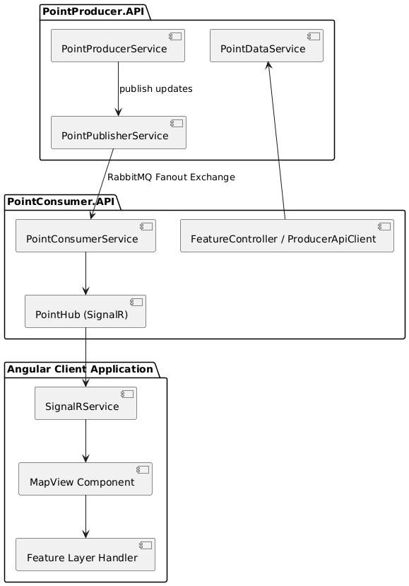
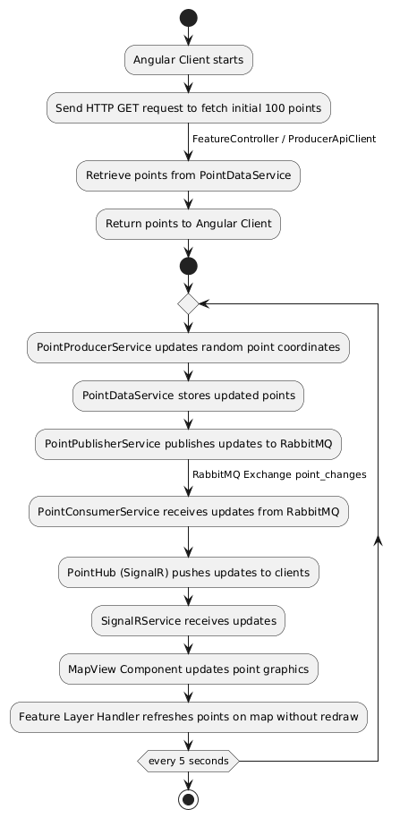

## Development of Real-Time Mapping System

In this project, I built a real-time mapping system that visualizes geographic points on a map with **low latency updates**. The system is designed as a modern distributed architecture with three main components:

- **PointProducer.API (Data Producer Service)**
- **PointConsumer.API (Data Consumer and Publisher Service)**
- **Angular/Esri Frontend Client**

The main goal is to continuously update point coordinates and display them on a map **without refreshing the view**.

---

## Architecture Overview

The system is composed of the following layers:

### 1. PointProducer.API
- Stores **100 points in memory** in GeoJSON format.
- A **Hosted Service** updates random point coordinates every 5 seconds.
- Updates are published to **RabbitMQ** using a fanout exchange (`point_changes`).
- Configuration (RabbitMQ URI, timing, etc.) is managed via `appsettings.json` and the **IOptions pattern**.

### 2. PointConsumer.API
- Subscribes to RabbitMQ updates from the producer.
- Pushes updates to connected Angular clients using **SignalR**.
- Implements **resilience** with Polly to automatically retry on temporary failures.
- Provides HTTP GET endpoints for **initial data loading**.

### 3. Angular Client
- Fetches the initial 100 points via HTTP GET from the consumer API.
- Connects to SignalR for **real-time updates**.
- Updates point coordinates dynamically on the **Esri MapView**, without re-rendering the entire map.

---

## Package Diagram

---

## Live Update Flow

Here is a simplified **activity flow** for live updates:

---

## GIF Demonstration

The GIF below demonstrates the **real-time updating of geographic points on the map**, showing how our system continuously reflects changes without refreshing the view.

---

## Key Technologies

- **Backend:** ASP.NET Core Web API, Hosted Service, RabbitMQ, SignalR, Polly, Serilog, JWT
- **Frontend:** Angular, Esri MapView, SignalR Client
- **Data Format:** GeoJSON

---

## Challenges & Solutions

- **Real-time updates:** Achieved with SignalR and in-memory data storage.
- **Scalability:** RabbitMQ fanout exchange ensures updates reach all connected clients.
- **Error handling:** Polly provides automatic retry mechanisms for temporary network failures.
- **Frontend performance:** Only updated points are refreshed on the map, avoiding full redraws.

---

## Conclusion

This project allowed me to explore **distributed systems, real-time messaging, and dynamic frontend updates**. It demonstrates how modern web technologies can be combined to create **low-latency, interactive mapping applications**.
